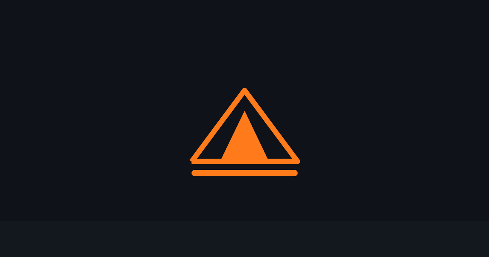

> **คำแปล** หน้านี้อาจล้าหลังกว่าฉบับภาษาอังกฤษ ให้ยึดตาม [README.md](../../README.md)

**ภาษา:** [English](../../README.md) | [Português (Brasil)](../pt-BR/README.md) | [简体中文](../../README.zh-CN.md) | [繁體中文](../zh-TW/README.md) | [日本語](../ja-JP/README.md) | [한국어](../ko-KR/README.md) | [Türkçe](../tr/README.md) | [Русский](../ru/README.md) | [Tiếng Việt](../vi-VN/README.md) | **ไทย** | [Deutsch](../de-DE/README.md) | [Українська](../uk-UA/README.md)

# FORGE



[](https://github.com/carlcastanas/forge/stargazers)
[](https://github.com/carlcastanas/forge/network/members)
[](https://github.com/carlcastanas/forge/graphs/contributors)
[](https://www.npmjs.com/package/forge-universal)
[](../../LICENSE)

> **182K+ ดาว** | **28K+ fork** | **170+ คอนทริบิวเตอร์** | **12+ ระบบนิเวศภาษาโปรแกรม**

---

<div align="center">

**ภาษา / Language / 语言 / 語言 / Dil / Язык / Ngôn ngữ**

[English](../../README.md) | [Português (Brasil)](../pt-BR/README.md) | [简体中文](../../README.zh-CN.md) | [繁體中文](../zh-TW/README.md) | [日本語](../ja-JP/README.md) | [한국어](../ko-KR/README.md) | [Türkçe](../tr/README.md) | [Русский](../ru/README.md) | [Tiếng Việt](../vi-VN/README.md) | **ไทย** | [Deutsch](../de-DE/README.md) | [Українська](../uk-UA/README.md)

</div>

---

**FORGE คือระบบเพิ่มประสิทธิภาพสำหรับ AI agent harness**

FORGE ไม่ใช่แค่ชุดไฟล์คอนฟิก แต่เป็นระบบครบวงจร: skills, สัญชาตญาณ (instincts), การจัดการหน่วยความจำ (memory optimization), การเรียนรู้ต่อเนื่อง (continuous learning), การสแกนความปลอดภัย (security scanning) และการพัฒนาที่ตรวจสอบจากแหล่งข้อมูลจริง (research-first development) ทั้งหมดนี้ผ่านการใช้งานจริงมากกว่า 10 เดือนในการสร้างผลิตภัณฑ์จริง

ใช้งานได้ข้าม **Claude Code**, **Codex**, **Cursor**, **OpenCode**, **Gemini**, **Zed**, **GitHub Copilot** และ AI agent harness อื่น ๆ

หน้านี้คือคู่มือเริ่มต้นใช้งานฉบับย่อภาษาไทย สำหรับเนื้อหาเต็มและล่าสุดเสมอ ให้อ้างอิงจาก [README ภาษาอังกฤษ](../../README.md) เป็นหลัก

---

## เริ่มต้นใช้งานอย่างเร็ว

### เลือกวิธีติดตั้งเพียงวิธีเดียว

สำหรับผู้ใช้ Claude Code ส่วนใหญ่ ควรเลือก **เพียงหนึ่ง** ในสองวิธีต่อไปนี้:

- **แนะนำ:** ติดตั้งผ่าน Claude Code plugin จากนั้นค่อยคัดลอกเฉพาะโฟลเดอร์ `rules/` ที่ต้องการใช้จริงด้วยมือ
- **ใช้ installer แบบ manual** หากต้องการควบคุมรายละเอียดมากขึ้น หรือต้องการเลี่ยง plugin หรือ Claude Code ของคุณไม่สามารถ resolve marketplace ที่ self-host ได้
- **อย่าติดตั้งซ้อนกันหลายวิธี** ปัญหาที่พบบ่อยที่สุดคือการรัน `/plugin install` ก่อน แล้วตามด้วย `install.sh --profile full` หรือ `npx forge-universal install --profile full`

หากคุณติดตั้งซ้อนกันไปแล้วและพบว่ามี skill/hook ซ้ำ ดู [Reset / ถอนการติดตั้ง FORGE](#reset--ถอนการติดตั้ง-forge)

### ติดตั้งผ่าน Claude Code plugin

```bash
# เพิ่ม marketplace
/plugin marketplace add https://github.com/carlcastanas/forge

# ติดตั้ง plugin
/plugin install forge@forge
```

FORGE มีชื่อเรียกในระบบสาธารณะ 3 ชื่อที่ต่างกัน:

- GitHub repo: `carlcastanas/forge`
- Claude marketplace plugin: `forge@forge`
- npm package: `forge-universal`

ชื่อเหล่านี้ตั้งใจให้ต่างกัน Plugin บน Claude Code ใช้ `forge@forge` ส่วน npm ยังคงใช้ `forge-universal`

### คัดลอกไฟล์ rules เพิ่มเติม (ถ้าต้องการ)

Plugin ของ Claude Code จะไม่ติดตั้ง `rules/` ให้อัตโนมัติ หากคุณติดตั้งผ่าน plugin **อย่า** รัน full installer เพิ่ม ให้คัดลอกเฉพาะชุด rule ที่ต้องการแทน:

```bash
git clone https://github.com/carlcastanas/forge.git
cd forge

mkdir -p ~/.claude/rules/forge
cp -R rules/common ~/.claude/rules/forge/
cp -R rules/typescript ~/.claude/rules/forge/
```

```powershell
git clone https://github.com/carlcastanas/forge.git
cd forge

New-Item -ItemType Directory -Force -Path "$HOME/.claude/rules/forge" | Out-Null
Copy-Item -Recurse rules/common "$HOME/.claude/rules/forge/"
Copy-Item -Recurse rules/typescript "$HOME/.claude/rules/forge/"
```

ให้คัดลอกทั้งโฟลเดอร์ภาษา เช่น `rules/common` หรือ `rules/golang` แทนการคัดลอกไฟล์เดี่ยว ๆ

### ติดตั้งแบบ manual (ไม่ใช้ plugin)

ใช้วิธีนี้เฉพาะเมื่อคุณตั้งใจไม่ใช้ plugin:

```bash
npm install
./install.sh --profile full
```

```powershell
npm install
.\install.ps1 --profile full
# หรือ
npx forge-universal install --profile full
```

หากเลือกวิธี manual แล้ว ให้หยุดที่นี่ อย่ารัน `/plugin install` เพิ่ม

### แบบ low-context / ไม่มี hooks

หากต้องการเฉพาะ rules, agents, commands และ core workflow skills ให้ใช้ profile แบบมินิมัล:

```bash
./install.sh --profile minimal --target claude
```

```powershell
.\install.ps1 --profile minimal --target claude
# หรือ
npx forge-universal install --profile minimal --target claude
```

Profile นี้จงใจไม่ติดตั้ง `hooks-runtime`

---

## Reset / ถอนการติดตั้ง FORGE

หาก FORGE ติดตั้งซ้อนกัน รบกวนระบบ หรือทำงานผิดปกติ อย่ารันติดตั้งทับซ้ำเข้าไปอีก

- **วิธี plugin:** ถอน plugin ออกจาก Claude Code จากนั้นลบโฟลเดอร์ rule ที่คุณคัดลอกเองใน `~/.claude/rules/forge/`
- **วิธี installer/CLI:** ที่ root ของ repo ตรวจดูก่อน:

```bash
node scripts/uninstall.js --dry-run
```

จากนั้นถอนไฟล์ที่ FORGE ดูแล:

```bash
node scripts/uninstall.js
```

หรือใช้ lifecycle wrapper:

```bash
node scripts/forge.js list-installed
node scripts/forge.js doctor
node scripts/forge.js repair
node scripts/forge.js uninstall --dry-run
```

FORGE จะลบเฉพาะไฟล์ที่อยู่ใน install-state ของตัวเอง ไม่แตะไฟล์อื่นนอกเหนือจากนั้น

---

## คู่มือหลัก

ที่นี่เป็นเพียงโค้ดต้นฉบับ คู่มือเหล่านี้อธิบายรายละเอียดแบบเต็ม:

| คู่มือ | สิ่งที่คุณจะได้เรียนรู้ |
|--------|-------------------------|
| **Shorthand Guide** | การติดตั้ง พื้นฐาน และปรัชญา — อ่านก่อน |
| **Longform Guide** | การประหยัด token, การคงสภาพ memory, evals, การทำงานแบบขนาน |
| **Security Guide** | ช่องโหว่ของ agent, sandboxing, sanitization, CVE, Forge Shield |

| หัวข้อ | สิ่งที่คุณจะได้เรียนรู้ |
|-------|-------------------------|
| Token Optimization | การเลือกโมเดล, การลดขนาด system prompt, background processes |
| Memory Persistence | Hooks ที่บันทึก/โหลด context ข้าม session อัตโนมัติ |
| Continuous Learning | ดึง pattern จาก session เป็น skill ใหม่อัตโนมัติ |
| Verification Loops | Checkpoint vs continuous evals, ประเภท grader, ตัววัด pass@k |
| Parallelization | Git worktrees, cascade method, จังหวะการ scale instance |
| Subagent Orchestration | ปัญหา context, pattern การ retrieve แบบทำซ้ำ |

---

## เอกสารสำคัญ

- [README ภาษาอังกฤษ](../../README.md) — แหล่งข้อมูลหลักที่อัปเดตล่าสุดเสมอ
- [คู่มือติดตั้ง Hermes](../HERMES-SETUP.md)
- [Release notes v2.0.0-rc.1](../releases/2.0.0-rc.1/release-notes.md)
- [สถาปัตยกรรม cross-harness](../architecture/cross-harness.md)
- [Troubleshooting](../TROUBLESHOOTING.md)
- [Hook bug workarounds](../hook-bug-workarounds.md)
- [คู่มือการพัฒนา skill](../SKILL-DEVELOPMENT-GUIDE.md)

---

## ลองใช้งาน

```bash
# ติดตั้งผ่าน plugin ใช้ namespace เต็ม
/forge:plan "เพิ่มระบบยืนยันตัวตนผู้ใช้"

# ติดตั้งแบบ manual ใช้ slash command แบบสั้นได้
# /plan "เพิ่มระบบยืนยันตัวตนผู้ใช้"

# ดู plugin ที่ติดตั้งอยู่
/plugin list forge@forge
```

คำสั่งหลักที่ใช้บ่อย:

- `/tdd` — workflow แบบ Test-Driven Development
- `/plan` — วางแผนการ implement
- `/e2e` — สร้างและรัน E2E tests
- `/code-review` — ตรวจคุณภาพโค้ด
- `/build-fix` — แก้ปัญหา build
- `/learn` — ดึง pattern จาก session
- `/skill-create` — สร้าง skill จาก git history

ปัจจุบัน FORGE มี agent หลายสิบตัว, skill มากกว่า 200 ชุด และ legacy command shim สำหรับ workflow ต่าง ๆ ดูรายการเต็มและคำแนะนำล่าสุดได้ใน [README ภาษาอังกฤษ](../../README.md)

---

## ร่วมพัฒนาโปรเจกต์

ยินดีต้อนรับการ contribute! สำหรับคู่มือฉบับเต็ม โปรดดู [CONTRIBUTING.md](../../CONTRIBUTING.md)

หมวดที่กำลังต้องการการ contribute:

- **Agents** — agent เฉพาะภาษา (Python, Go, Rust), เฉพาะ framework (Django, Rails, Laravel, Spring), DevOps (Kubernetes, Terraform), domain expert (ML, data engineering, mobile)
- **Skills** — แนวปฏิบัติเฉพาะภาษา, pattern ของ framework, กลยุทธ์การทดสอบ, คู่มือสถาปัตยกรรม
- **Hooks** — automation, linting, security checks, validation, notification
- **Commands** — slash command สำหรับ deployment, testing, code generation
- **คำแปลภาษาอื่น ๆ** — ดูโครงสร้างใน `docs/` (เช่น `docs/zh-CN`, `docs/ja-JP`, `docs/th`)

### ขั้นตอนเริ่มต้นอย่างย่อ

```bash
# 1. Fork และ clone
gh repo fork carlcastanas/forge --clone
cd forge

# 2. สร้าง branch
git checkout -b feat/my-contribution

# 3. เพิ่มสิ่งที่ contribute (ดู CONTRIBUTING.md)

# 4. ทดสอบในเครื่อง
cp -r skills/my-skill ~/.claude/skills/

# 5. ส่ง PR
git add . && git commit -m "feat: add my-skill" && git push -u origin feat/my-contribution
```

---

## ชุมชน

- [GitHub Discussions](https://github.com/carlcastanas/forge/discussions) — ถาม-ตอบ, โชว์ผลงาน
- FORGE Pro — private repo + GitHub App ($19/seat/เดือน)
- FORGE Tools GitHub App — ติดตั้ง, PR audit, มี free tier

**OSS ยังคงฟรีตลอดไป** Repo นี้ใช้สัญญาอนุญาต MIT ตลอดกาล FORGE Pro คือ GitHub App ที่ host ไว้สำหรับ private repo

---

## License

[MIT](../../LICENSE)
