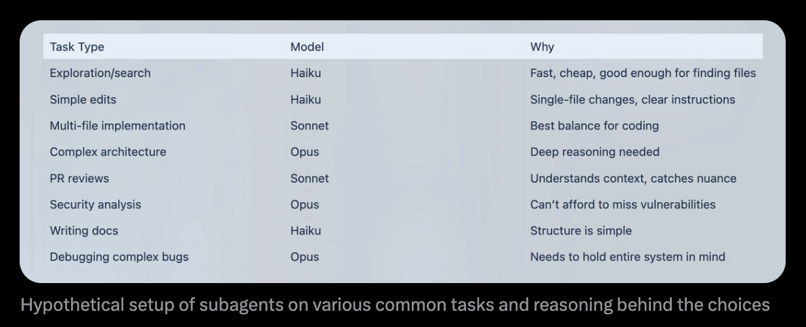

# The complete guide to FORGE

This guide is for an engineer who already runs an agent daily and now wants to understand why
the system is built the way it is: where the real constraints are, what the defaults are
trading off, and how to tell whether a change to the setup actually helped. After reading it you
should be able to reason about context, model routing, memory, and orchestration from first
principles rather than by copying a configuration.

Prerequisites:

- [The FORGE field guide](./the-field-guide.md), or equivalent hands-on time. This guide assumes
  you know what skills, commands, agents, hooks, and rules are and how to invoke them.
- FORGE installed and a repository you actually work in.

---

## Contents

- [The one constraint that shapes everything](#the-one-constraint-that-shapes-everything)
- [Context economics](#context-economics)
  - [What is actually in the window](#what-is-actually-in-the-window)
  - [The degradation curve](#the-degradation-curve)
  - [Progressive disclosure](#progressive-disclosure)
  - [Measuring consumption](#measuring-consumption)
  - [Compaction](#compaction)
  - [Context presets and dynamic injection](#context-presets-and-dynamic-injection)
  - [Trading connectors for command-line tools](#trading-connectors-for-command-line-tools)
  - [Codemaps and repository shape](#codemaps-and-repository-shape)
- [Session storage and resumption](#session-storage-and-resumption)
  - [The session file contract](#the-session-file-contract)
  - [Lifecycle hooks as the persistence layer](#lifecycle-hooks-as-the-persistence-layer)
  - [The state store and the CLI](#the-state-store-and-the-cli)
  - [Handoffs across harnesses](#handoffs-across-harnesses)
- [Model selection and routing](#model-selection-and-routing)
  - [The routing table](#the-routing-table)
  - [Escalation triggers](#escalation-triggers)
  - [Routing at the agent level](#routing-at-the-agent-level)
  - [Cost as a signal](#cost-as-a-signal)
- [Memory and continuous learning](#memory-and-continuous-learning)
  - [Three timescales](#three-timescales)
  - [Instincts](#instincts)
  - [Why the Stop hook](#why-the-stop-hook)
  - [Scope and promotion](#scope-and-promotion)
  - [Memory hygiene](#memory-hygiene)
- [Evaluation](#evaluation)
  - [Why an eval and not an opinion](#why-an-eval-and-not-an-opinion)
  - [pass@k and pass^k](#passk-and-passk-1)
  - [A and B with the same task](#a-and-b-with-the-same-task)
  - [Eval surfaces in the repository](#eval-surfaces-in-the-repository)
  - [Checkpoint and continuous evals](#checkpoint-and-continuous-evals)
- [Parallel agents and orchestration](#parallel-agents-and-orchestration)
  - [The orchestrator contract](#the-orchestrator-contract)
  - [The subagent context problem](#the-subagent-context-problem)
  - [Sequential phases](#sequential-phases)
  - [Waves and fan-out](#waves-and-fan-out)
  - [Adversarial verification](#adversarial-verification)
  - [When not to parallelize](#when-not-to-parallelize)
- [Measuring whether any of it works](#measuring-whether-any-of-it-works)
- [The defaults, and why](#the-defaults-and-why)
- [Where to go next](#where-to-go-next)

---

## The one constraint that shapes everything

> Optimize the context window. Persist everything else.

Almost every design decision in FORGE follows from that sentence, so it is worth stating the
argument in full.

A coding agent has one working memory: the context window. Everything the model can reason about
in a turn is in there — the system prompt, the rules, the tool schemas, the conversation, the
file contents it has read, the tool results. It is fixed in size, it is consumed monotonically
within a session, and its contents are the entire basis of the model's judgment.

Three consequences follow.

**First, context is a budget, not a container.** Tokens spent on a connector's tool schemas are
tokens not available for the file you are debugging. There is no separate allocation. Everything
competes.

**Second, quality degrades before capacity is reached.** Long contexts are not uniformly
attended to. Material in the middle of a long window receives less effective weight than
material at the ends. A session at 85 percent capacity is not 85 percent as good as an empty
one; it is measurably worse at recalling decisions it made an hour ago, and it does not announce
that it has gotten worse.

**Third, everything else can be a file.** Skills, rules, plans, session state, learned patterns,
review findings, codemaps — all of it can live on disk and be loaded on demand. Disk is cheap,
inspectable, diffable, and survives a restart. The window is none of those things.

So the strategy is: keep the window small and relevant, and move everything durable to disk.
That is what the skill loader, the session files, the instinct store, the hook system, and the
subagent architecture are all doing. They are the same idea applied at different layers.

---

## Context economics

### What is actually in the window

Before a single user message, a session is already carrying:

| Consumer | Typical behavior |
|---|---|
| Harness system prompt | Fixed, not under your control |
| Project instructions (`CLAUDE.md`) | Loaded in full, every session |
| Rule files | Loaded in full, every session |
| Skill descriptions | One short description per available skill |
| Tool schemas — built-ins | Fixed |
| Tool schemas — MCP servers | Grows linearly with connected servers |
| Memory and session bootstrap | Whatever `SessionStart` injects |

Only the last four are yours to control, and the MCP line is the one that moves most. A single
connector can contribute thirty tool definitions. A dozen connectors can consume a substantial
fraction of the window before you have described your task. This is why
[docs/MCP-CONNECTOR-POLICY.md](../docs/MCP-CONNECTOR-POLICY.md) sets a default of exactly one
connector and requires a two-pronged argument to add another.

Skill descriptions behave differently and better. FORGE ships several hundred skills, but only
the `description` frontmatter of each is resident. The body loads when the skill fires. That is
why a large catalog is affordable and a large connector set is not.

### The degradation curve

Watch for these in order. They appear well before the window is full:

1. **Repetition.** The agent re-reads a file it read twenty minutes ago, or re-derives a
   conclusion it already stated.
2. **Decision drift.** A constraint agreed early in the session stops being honored. Naming
   conventions slip. An interface that was settled gets redesigned.
3. **Scope creep.** Edits appear in files unrelated to the task, usually because the original
   task boundary has faded.
4. **Confident wrongness.** Claims about the codebase that were true three files ago.

Once you see stage two, the session is not going to recover by being asked nicely. Save state and
start fresh. That is cheaper than the debugging you would otherwise do.

### Progressive disclosure

The general pattern: load an index that is small, load a body only when the index matches.

- **Skills** load a description always, a body on relevance.
- **Subagents** load an entire investigation into a separate window and return a paragraph.
- **Codemaps** load a structural summary of a repository instead of its files.
- **Session files** load the conclusions of a previous session instead of its transcript.
- **Commands** load a workflow only when you type it.

Each of these is the same trade: pay a small fixed cost for a pointer, pay the large cost only
when it is needed. When you design your own additions to the system, ask what the index is. If a
thing has no cheap index and must be loaded in full, it belongs in a subagent or a file, not in
the main window.

### Measuring consumption

Do not guess. Three instruments:

**The status line.** `scripts/hooks/forge-statusline.js` renders live context usage as a colored
bar, plus model, cost, tool count, and files modified. Configuration template at
[examples/statusline.json](../examples/statusline.json). It is the cheapest instrumentation
available and the one people most often skip.

**The `context-budget` skill.** Audits consumption across agents, skills, MCP servers, and rules,
identifies redundant components, and produces a prioritized list of what to remove. Run it when
a session feels slow, not after it has already failed.

**The cost log.** `cost-tracker.js` appends to a local metrics log on every `Stop`. `/cost-report`
reads it. Token spend is a proxy for context pressure: a task that costs three times what a
comparable task cost last week is usually re-reading things it should not need to.

### Compaction

Compaction rewrites the conversation into a summary so the session can continue. Automatic
compaction fires when the window fills, which means it fires at an arbitrary point — frequently
in the middle of a multi-file edit, where the details it discards are the ones you needed.

The alternative is to compact deliberately, at phase boundaries:

- After research, before planning.
- After planning, before implementation.
- After implementation, before review.

At each of those points the previous phase's working detail is genuinely disposable, because its
conclusion has been written down. Compacting there loses nothing.

FORGE supports this at two levels. `suggest-compact.js` is a `PreToolUse` hook that flags when
the window is getting tight, so the boundary decision is prompted rather than remembered. The
`strategic-compact` skill handles the compaction itself at a logical interval. `pre-compact.js`
runs on the `PreCompact` event and persists state before the rewrite happens, which is the
safety net for the case where automatic compaction fires anyway.

The pattern that makes compaction almost unnecessary: after planning, write the plan to a file,
clear, and start the implementation session with the plan file as its only inherited context.
The exploration that produced the plan does not need to survive.

### Context presets and dynamic injection

Everything in project instructions and rules loads every session, regardless of what you are
doing. Research context is dead weight during implementation and vice versa.

FORGE ships three presets in [contexts/](../contexts/):

| Preset | Posture |
|---|---|
| `contexts/dev.md` | Implementation. Write code first, prefer working over perfect, run tests after changes, keep commits atomic. |
| `contexts/review.md` | Review. Read before judging, cite evidence. |
| `contexts/research.md` | Exploration. Read widely before concluding, do not write code until the understanding is clear. |

Inject one at launch instead of carrying all three:

```bash
alias claude-dev='claude --system-prompt "$(cat ~/.claude/contexts/dev.md)"'
alias claude-review='claude --system-prompt "$(cat ~/.claude/contexts/review.md)"'
alias claude-research='claude --system-prompt "$(cat ~/.claude/contexts/research.md)"'
```

There is a second reason to use the system prompt rather than a first user message. Instruction
authority is layered: system prompt outranks user messages, which outrank tool results. A
constraint that must survive an adversarial tool result belongs in the system prompt. A
constraint that must survive the model's own reasoning belongs in a hook. See
[the security guide](./the-security-guide.md#the-tool-permission-model) for why that ordering
matters under attack.

### Trading connectors for command-line tools

Most MCP servers wrap a system that already has a good command-line interface. Version control,
databases, deployment platforms, issue trackers. The server is a convenience layer over
something the model can already drive.

The trade:

| | MCP server | CLI wrapped in a skill |
|---|---|---|
| Session cost | Tool schemas resident always | Skill description only |
| Per-call cost | Structured, often verbose results | Whatever you asked the command to print |
| Discoverability | Tools appear in the tool list | Skill must match on description |
| Auth | Per-server configuration | Existing credential, once |
| Model familiarity | Learned from schema | Common CLIs are in training data |
| Best at | Held-open sessions, streaming, browsing | One-shot request and response |

The decision rule is whether the job needs held-open state. Interactive browser debugging over
the DevTools Protocol does — the value is the live session. Creating a pull request does not;
that is one command with flags.

This is why FORGE retired six default connectors in favor of skills wrapping `gh`, a
documentation REST API, harness-native search, and the Playwright CLI, and dropped two more
outright because harnesses absorbed the functionality natively. All eight remain available as
opt-in entries in [mcp-configs/mcp-servers.json](../mcp-configs/mcp-servers.json).

Note the limit honestly: lazy loading and connection toggles largely solve the resident-context
problem. They do not solve per-call token cost. A verbose tool result is verbose whether it came
from a connector or a command. The CLI path wins on both, which is why it is the default.

### Codemaps and repository shape

Two structural properties of the repository itself change how much context a task costs.

**Codemaps.** `/update-codemaps` scans the project and generates token-lean architecture
summaries. An agent that reads a codemap knows where things live without opening thirty files to
find out. The `doc-updater` agent keeps them in sync.

**Module size.** A codebase of many small files costs less context per task than one of few large
files, because the agent can load exactly the relevant module. It also raises first-attempt
success rates, because the model holds a complete unit rather than a fragment of one. This is
ordinary good engineering; it happens to pay double when an agent is reading the code.

If you are choosing where to spend refactoring effort in a repository an agent works in daily,
splitting the multi-thousand-line files is usually the highest-return change available.

---

## Session storage and resumption

### The session file contract

Context does not survive. Files do. `/save-session` writes to
`~/.claude/session-data/YYYY-MM-DD-<short-id>-session.tmp`; `/resume-session` reads the most
recent one, or a path you give it. `/sessions` lists, aliases, and inspects the history.

A session file that only says what was built is close to useless, because the diff already says
that. The three things a fresh context cannot reconstruct:

1. **What worked, with evidence.** Not "fixed the auth bug" but "the failure was a missing
   `await` in `session.ts:112`; the regression test in `auth.test.ts` now covers it and passes".
2. **What was tried and failed, and why.** This is the highest-value section and the one most
   often omitted. Without it, the next session re-walks every dead end, at full price.
3. **What has not been attempted, and what remains.** The open frontier, stated as tasks rather
   than as narrative.


Timing matters. A file written at 80 percent context is written by a model that still remembers
the details. A file written at 98 percent is a summary of a summary. Save before you are forced
to, and treat the file as a draft: read it, correct it, then start fresh.

One file per session. Appending to yesterday's file drags stale context into today's work, which
is the exact failure the mechanism exists to avoid.

### Lifecycle hooks as the persistence layer

Persistence that depends on you remembering to run a command will fail on the day it matters.
FORGE registers hooks on the four boundary events:

| Event | Hook | Purpose |
|---|---|---|
| `SessionStart` | `session-start-bootstrap.js` | Load prior context into a new session |
| `PreCompact` | `pre-compact.js` | Persist state before the window is rewritten |
| `Stop` | `session-end.js`, `evaluate-session.js`, `cost-tracker.js` | Record outcomes, self-evaluate, log spend |
| `SessionEnd` | `session-end-marker.js` | Close the session record |

`FORGE_SESSION_START_CONTEXT` and `FORGE_SESSION_START_MAX_CHARS` control what the bootstrap
injects and how much of it, which is the knob to reach for when session start is itself becoming
a context cost. `FORGE_SESSION_RETENTION_DAYS` governs how long the records live.

### The state store and the CLI

Sessions are also recorded in a local SQLite state store, readable outside the harness:

```bash
forge sessions          # list sessions from the state store
forge session-inspect   # emit canonical session snapshots
forge status            # state store summary
forge work-items        # linked issues, handoffs, manual items
forge loop-status       # stale loop wakeups and pending tool results
```

This matters most when several sessions are running at once. `/sessions info` returns branch,
worktree path, and recency, which answers "what is that terminal doing" without switching to it
and reading scrollback.

### Handoffs across harnesses

The `unified-memory` skill and `forge memory` write to a local Memory Vault that is readable by
whichever agent picks up the work next, across the harnesses FORGE supports. The relevant
environment variables are `FORGE_MEMORY_HARNESS`, `FORGE_MEMORY_PROJECT_ROOT`,
`FORGE_MEMORY_USER_ROOT`, and `FORGE_MEMORY_ALLOW_USER_SCOPE`.

Use it for genuine handoffs — one agent researches, another implements — rather than as a general
knowledge store. Shared durable memory across agents is also shared attack surface; see
[the security guide](./the-security-guide.md#memory-as-an-attack-surface).

---

## Model selection and routing

### The routing table

Running every task on the strongest model is expensive and, on simple tasks, no better. Running
everything on the cheapest is cheap and, on hard tasks, actively costly — a failed attempt
consumes context and then you pay for the retry anyway.



| Task | Tier | Reasoning |
|---|---|---|
| File and symbol search | Fast | Finding things is pattern matching, not reasoning |
| Single-file mechanical edits | Fast | Clear instructions, narrow blast radius |
| Documentation and changelog | Fast | Structure is known, the content already exists |
| Multi-file implementation | Mid | The default. Best cost-to-quality ratio for coding |
| Test authoring | Mid | Needs to understand behavior, not just syntax |
| Pull request review | Mid | Enough context sensitivity to catch real issues |
| Architecture and system design | Top | Tradeoffs across constraints that do not fit a pattern |
| Security analysis | Top | The cost of a miss is not symmetric with the cost of the model |
| Debugging across subsystems | Top | Requires holding the whole system in mind at once |
| Ambiguous or underspecified work | Top | Resolving ambiguity is the actual task |

The mid tier is the correct default for the large majority of coding work. Treat top-tier usage
as a deliberate escalation, not a comfort setting.

`/model-route` applies this to a described task and returns a recommendation, a confidence level,
the reasoning, and a fallback if the first attempt fails.

### Escalation triggers

Escalate when one of these is true, not on a hunch:

- The first attempt at the mid tier produced something wrong in an interesting way — not a typo,
  a misunderstanding.
- The change spans five or more files with real coupling between them.
- The decision is architectural, meaning it will be expensive to reverse.
- The code is security-sensitive: authentication, authorization, cryptography, payment,
  data deletion.
- The requirements are ambiguous and the model needs to resolve the ambiguity rather than
  implement a settled decision.

De-escalate for search, mechanical refactors, formatting, documentation, and any task where the
answer is verifiable by running a command.

### Routing at the agent level

The cleanest place to encode this is agent frontmatter, because it applies automatically every
time the agent runs:

```yaml
---
name: code-explorer
description: Locate implementations, call sites, and conventions across a repository.
tools: Read, Grep, Glob
model: haiku
---
```

```yaml
---
name: security-reviewer
description: Vulnerability analysis on diffs and configuration. Run before commits that touch
  authentication, secrets, or externally reachable endpoints.
tools: Read, Grep, Glob
model: opus
---
```

A useful side effect: the orchestrator can run at the top tier while doing most of its work
through cheap subagents. The expensive model spends its tokens on judgment and delegation, not
on reading files.

### Cost as a signal

`cost-tracker.js` logs on every `Stop`; `/cost-report` summarizes; the `cost-tracking` skill
handles budgets and alerts. `FORGE_CONTEXT_MONITOR_COST_WARNINGS` toggles inline warnings.

Read cost as diagnostics rather than as a bill. A task that costs several times a comparable
task usually means one of three things: the agent is re-reading material it should have kept, a
subagent is returning raw output instead of a summary, or a top-tier model is doing work a fast
one could do. All three are fixable.

Further detail in [docs/COST-AND-MODEL-ROUTING.md](../docs/COST-AND-MODEL-ROUTING.md).

---

## Memory and continuous learning

### Three timescales

"Memory" describes three different mechanisms with three different lifetimes, and conflating them
is the source of most confusion about it:

| Timescale | Mechanism | Lifetime | Cost |
|---|---|---|---|
| Within a session | The context window | Until compaction | Occupies the budget |
| Across sessions | Session files, Memory Vault | Until deleted | Loaded on demand |
| Across projects | Skills, rules, instincts | Indefinite | Description resident, body on demand |

The third is the one that compounds. A pattern captured as a skill applies to every future
session on every project, and it keeps applying as models improve, because the model gets better
at using the workflow you encoded rather than needing the workflow re-explained.

### Instincts

An instinct is an atomic learned fact with a confidence score, project or global scope, and a
promotion path into a skill, command, or agent. The `continuous-learning-v2` skill observes
sessions through hooks and creates them; the command surface manages them:

```text
/instinct-status     learned instincts, project and global, with confidence
/instinct-export     export to a file
/instinct-import     import from a file or URL
/promote             promote a project instinct to global scope
/prune               delete pending instincts older than 30 days that were never promoted
/evolve              analyze instincts and suggest or generate evolved structures
/projects            known projects and their instinct statistics
```

Confidence scoring exists because the alternative is an ever-growing pile of low-quality
observations that eventually costs more to carry than it saves. An instinct earns promotion by
recurring. `FORGE_INSTINCT_CONFIDENCE_THRESHOLD` and `FORGE_MAX_INJECTED_INSTINCTS` bound both
the quality floor and the context cost, and `FORGE_INSTINCT_RELEVANCE_RANKING` controls which
ones get injected when there are more than the budget allows.

`/prune` is not optional maintenance. A learning system without a forgetting mechanism degrades
into noise.

### Why the Stop hook

The design decision worth understanding: learning extraction runs on `Stop`, not on every user
message.

A hook on message submission runs on every single prompt. Even a fast one adds latency to every
interaction, and the aggregate cost across a long session is significant. Worse, mid-session is
the wrong time to judge whether something is worth remembering — the outcome is not known yet.

`Stop` runs once per turn boundary, when there is an actual outcome to evaluate, and its latency
lands where you are already reading output. `evaluate-session.js` runs there alongside the
learning extraction.

Manual extraction remains available. `/learn` pulls patterns from the current session on demand;
`/learn-eval` self-evaluates quality first and decides whether the result belongs in global or
project scope.

### Scope and promotion

Two scopes, and the boundary is meaningful:

- **Project scope.** Conventions of this codebase, quirks of its dependencies, its deployment
  particulars. Wrong to apply elsewhere.
- **Global scope.** Language patterns, debugging techniques, library behavior that holds
  regardless of project.

Default to project scope. Promote with `/promote` once a pattern has proven itself in more than
one place. Promoting too eagerly produces global rules that are wrong in most projects, which is
worse than having no rule.

### Memory hygiene

Persistent memory is a durable channel into future sessions, which is exactly what makes it
useful and exactly what makes it dangerous. Content that reaches memory from an untrusted source
can influence sessions long after the source is forgotten.

Practical rules:

- No secrets in memory files, ever. They are plain text and they are long-lived.
- Keep project and global memory separate, so a poisoned project cannot contaminate everything.
- Reset or rotate memory after a session that processed untrusted material.
- Disable long-lived memory entirely for workflows that routinely ingest foreign content.
- Review memory files periodically. Nobody does this. It is where planted content survives.

See [docs/MEMORY-GUIDE.md](../docs/MEMORY-GUIDE.md) and
[the security guide](./the-security-guide.md#memory-as-an-attack-surface).

---

## Evaluation

### Why an eval and not an opinion

Every configuration change to an agent system feels like an improvement. Adding a skill feels
like an improvement. Adding three rules feels like an improvement. Some of them are; some make
things measurably worse by consuming context or by conflicting with each other. Without
measurement there is no way to tell, and setups accumulate cruft indefinitely.

An eval is a task set with a checkable success criterion, run against two configurations. That
is the whole idea. The engineering is in choosing tasks that represent your actual work and
criteria a script can check.

### pass@k and pass^k

Two metrics, and choosing the wrong one hides the failure that matters.

**pass@k** — at least one of `k` attempts succeeds. This is the right metric when you will
review the output and can retry: interactive coding, exploration, drafting.

**pass^k** — all `k` attempts succeed. This is the right metric when the workflow runs unattended
and any single failure is a real failure: CI gates, automated reviews, scheduled agents.

The gap between them is large and gets larger fast. For a per-attempt success rate of `p`:

```text
pass@k = 1 - (1 - p)^k        pass^k = p^k

p = 0.70    k=1: 0.70    k=3: 0.97    k=5: 1.00     (pass@k)
p = 0.70    k=1: 0.70    k=3: 0.34    k=5: 0.17     (pass^k)
```

A workflow that looks reliable under pass@k can be close to useless under pass^k. Before you
automate anything, decide which regime it is in. Anything running without a human in the loop is
in the second, and should be held to it.

### A and B with the same task

The most useful eval you can run takes ten minutes.

1. Pick a task representative of your real work, specific enough to have a right answer.
2. Create two worktrees from the same commit.
3. Run the task in both, with the change under test enabled in one and disabled in the other.
4. Diff the results. Compare the diffs, the tool call counts, the token spend, and whether the
   tests pass.

```bash
git worktree add ../eval-with feature-eval-with
git worktree add ../eval-without feature-eval-without
# run the same prompt in each, then:
diff -ru ../eval-without ../eval-with
```

Run it three times per side, not once. Agent output is stochastic; a single run tells you almost
nothing. Three runs will not give you statistical significance either, but they will reliably
catch a change that made things worse, which is the failure mode you are actually screening for.

### Eval surfaces in the repository

| Surface | Use |
|---|---|
| `eval-harness` skill | Formal eval framework for agent workflows; eval-driven development |
| `agent-eval` skill | Head-to-head agent comparison on custom tasks: pass rate, cost, time, consistency |
| `agent-self-evaluation` skill | Post-task self-rating on accuracy, completeness, clarity, actionability, conciseness, with evidence per criterion |
| `evaluate-session.js` | `Stop` hook that runs session evaluation automatically |
| `/learn-eval` | Quality gate before a learned pattern is saved |
| `harness-audit` skill, `forge platform-audit` | Deterministic scorecard over repository and platform surfaces |

Self-evaluation deserves a caveat. Asking a model whether it did well produces agreement, which
is why `agent-self-evaluation` requires concrete evidence per criterion rather than a score
alone, and why the same principle drives `gateguard`: demanding facts changes behavior in a way
that demanding introspection does not.

### Checkpoint and continuous evals

**Checkpoint evals** run at defined phase boundaries with explicit criteria — after planning,
after implementation, before merge — and block progress until they pass. `/checkpoint` creates
and verifies them. Failures are cheap here because the work is fresh and the scope is small.

**Continuous evals** run on a timer or on every significant change: the test suite, the linter,
the typechecker, the console-log check. FORGE runs these as `PostToolUse` and `Stop` hooks so
they need no discipline to happen.

Both are needed. Continuous evals catch mechanical regressions immediately. Checkpoint evals
catch the ones that only make sense at a larger scale — the design is wrong, the tests assert
the wrong thing, the feature does not do what was asked.

More in [the evaluation guide](./the-evaluation-guide.md) and
[docs/EVALUATION-GUIDE.md](../docs/EVALUATION-GUIDE.md).

---

## Parallel agents and orchestration

### The orchestrator contract

An orchestrator holds the objective and delegates the work. The contract that makes this reliable
has four clauses:

1. **One clear input, one clear output per agent.** An agent asked to "look into the auth stuff"
   returns something unusable. An agent asked to "list every call site of `requireAuth` and note
   which ones already pass a tenant id" returns something you can act on.
2. **Outputs become inputs.** Phase N's artifact is phase N+1's brief. If it cannot be written
   down, the phase boundary is in the wrong place.
3. **Intermediate outputs go to files.** A plan in a file survives compaction, can be read by a
   fresh session, and can be reviewed by you. A plan in the conversation cannot.
4. **The orchestrator never rubber-stamps.** Every return gets evaluated. Accepting subagent
   output uncritically converts a context-saving mechanism into an error-amplifying one.

### The subagent context problem

Subagents exist to save context by returning summaries. But the orchestrator holds semantic
context the subagent does not: the purpose behind the request, the constraints already agreed,
the reason this particular question is being asked. The subagent sees only the literal query.

Two failure shapes follow. The subagent answers the question asked rather than the question
meant. Or it summarizes away the one detail that mattered, because it had no way to know it
mattered.

The mitigation is to pass objective, not just question, and to iterate. The `iterative-retrieval`
skill formalizes this:

```text
1. Orchestrator sends query plus objective plus known constraints.
2. Subagent investigates and returns.
3. Orchestrator evaluates against the objective, not against plausibility.
4. If insufficient, orchestrator sends a specific follow-up. Subagent returns to the source.
5. Repeat, capped at three cycles.
```

The cap matters. Past three rounds the delegation has cost more than doing it inline would have,
and the right move is to pull the work back into the main context.

### Sequential phases

The default orchestration shape, and the one behind the `orch-*` family:

```text
Phase 1  RESEARCH     code-explorer            -> research-summary.md
Phase 2  PLAN         planner                  -> plan.md
Phase 3  IMPLEMENT    tdd-guide                -> code changes, tests first
Phase 4  REVIEW       code-reviewer            -> review-findings.md
Phase 5  VERIFY       build-error-resolver     -> green, or loop back to 3
```

The commands that implement variants of this:

| Command | Shape |
|---|---|
| `/orch-add-feature` | New feature end to end: research, plan, TDD, review, gated commit |
| `/orch-build-mvp` | From a spec document: ingest, slice, scaffold, TDD, review, gated commit |
| `/orch-change-feature` | Change existing behavior: update tests to the new spec first, then implement |
| `/orch-fix-defect` | Reproduce as a failing regression test, fix to green, review |
| `/orch-refine-code` | Behavior-preserving refactor: confirm green, restructure, stay green |
| `/orch-review` | Run the review workflow over a diff or a pull request |

Two rules that are load-bearing. Do not skip phases, particularly review — the phase most
frequently skipped is the one that catches the errors. And clear context between phases, because
each phase's brief is its input file, not the previous phase's reasoning.

### Waves and fan-out

Sequential phases are the default because most work has real dependencies. Fan-out applies where
work is genuinely independent:

- Reviewing one diff from several angles at once: security, performance, accessibility, types.
  These do not interact and the results merge cleanly.
- Investigating several hypotheses about a bug in parallel, then keeping whichever is confirmed.
- Applying one mechanical change across many independent modules.
- Running the same task under different configurations for an eval.

The precondition is non-overlapping writes. Two agents editing the same files produce conflicts
and, worse, contradictory refactors that each look correct alone. Where both must write, give
each its own worktree:

```bash
git worktree add ../project-feature-a feature-a
git worktree add ../project-feature-b feature-b
```

The `parallel-execution-optimizer` skill helps decompose a task into lanes that are actually
independent; `team-agent-orchestration` handles squad-shaped work with ownership, work items,
merge gates, and control-pane handoffs. `plan-orchestrate` reads a plan document and emits a
per-step agent chain from the catalog.


### Adversarial verification

A single reviewer that is wrong produces a confident approval. The counter is to require
independent agreement.

**`santa-method` and `/santa-loop`.** Two independent review agents must both pass before output
ships. They converge in a loop rather than voting once. Roughly double the cost of a single
review, which is the right price for anything touching authentication, money, or destructive
operations.

**Generator/evaluator loops.** `/gan-build` and `/gan-design` run bounded generate-and-score
iterations, backed by the `gan-generator`, `gan-evaluator`, and `gan-planner` agents. Useful when
quality is judgeable but not testable — visual work, API ergonomics, documentation clarity.

**`council`.** Convenes four voices for ambiguous decisions and go/no-go calls, producing
structured disagreement before a choice is made. Reach for it when several paths are defensible
and the failure mode is committing to one too early.

The common thread: these all cost more than a single pass, and they are worth it precisely where
a wrong answer is expensive to discover later.

### When not to parallelize

Parallelism is a throughput tool that consumes attention, and attention is what makes agent
output trustworthy. Two sessions you review carefully beat five you skim.

Do not parallelize when:

- The tasks touch the same files. That is a merge conflict scheduled for later.
- You cannot write down each session's scope in a sentence. Undefined scope produces overlap.
- You are already behind on reviewing what the current sessions produced.
- The task is small. Coordination overhead exceeds the work.

The useful target is not "how many agents can I run" but "how few can finish this correctly".
Add a session when a specific piece of work is genuinely blocked on parallelism, not to fill a
grid.

Detail in [the orchestration guide](./the-orchestration-guide.md) and
[docs/ORCHESTRATION-PATTERNS.md](../docs/ORCHESTRATION-PATTERNS.md).

---

## Measuring whether any of it works

The honest problem with agent tooling is that it is very easy to feel more productive while
producing more work for yourself. Faster diff generation is not the same as faster shipping.

Establish a baseline before changing anything. Not a benchmark — a description of your current
reality specific enough to notice a change in:

- How long a representative task takes end to end, including review and rework.
- How often the first attempt is accepted without substantive changes.
- How often you abandon a session and restart.
- What a typical session costs.
- How often something reaches review that should have been caught by a check.

Then instrument. The signals available without extra work:

| Signal | Source | Reads as |
|---|---|---|
| Context usage over time | Status line | How fast the window fills |
| Cost per task | `/cost-report` | Efficiency; spikes mean re-reading or wrong tier |
| Session evaluations | `evaluate-session.js` | Per-session outcome trend |
| Hook block frequency | Hook stderr, governance capture | Which mistakes are recurring |
| Instinct accumulation | `/instinct-status`, `/projects` | Whether learning is happening |
| Skill invocation counts | `skill-run-tracker.js`, `/skill-health` | Which skills earn their place |
| Harness scorecard | `harness-audit`, `forge platform-audit` | Configuration drift |

Two interpretive notes. A skill that never fires has a bad description or no purpose; check the
description before deleting it. A hook that blocks constantly is either catching a real recurring
mistake, in which case fix the underlying cause, or has a bad matcher, in which case fix the
matcher. Both are actionable; neither is a reason to disable the hook and move on.

The failure modes to watch for in yourself:

- **Configuration as procrastination.** Tuning the setup instead of doing the work. If the last
  three sessions were about the harness, that is the signal.
- **Unread output.** Volume of generated diff is not throughput. If you are not reading it, you
  are accumulating unreviewed liability.
- **Cargo-culted config.** Copying a setup without knowing what each part costs. Every skill,
  rule, and connector is a context expense. Justify each one or remove it.
- **Missing rollback.** A configuration change with no way to tell whether it helped is a change
  you cannot reverse rationally.

---

## The defaults, and why

A summary of the positions this guide has argued, in one place:

| Default | Reasoning |
|---|---|
| One MCP connector, everything else a skill over a CLI | Tool schemas tax every session; only held-open state justifies a connector |
| Mid-tier model for coding, escalate deliberately | Best cost-to-quality ratio; escalation on specific triggers, not on feel |
| Hook profile `standard` | Formatting, typechecking, and verification without gates that fight you |
| Review from a separate context | The process that wrote the code is the worst judge of it |
| Test before implementation | The test is the specification; writing it after fits it to the code |
| Compact at phase boundaries | Automatic compaction discards whatever it happens to be holding |
| One session file per session | Appending drags stale context into new work |
| Project scope for learned patterns by default | A global rule that is wrong most places is worse than none |
| Learning extraction on `Stop` | Once per turn boundary, with a known outcome, off the interactive path |
| Two terminals before more | Coordination cost is real; review capacity is the binding constraint |
| Cap delegation loops at three cycles | Past that, inline work is cheaper than the round trips |

None of these are arbitrary, and none are sacred. Change one, run an A/B, keep the result if it
holds. What you should not do is change several at once and conclude from a feeling.

---

## Where to go next

- [The FORGE field guide](./the-field-guide.md) — the day-to-day operating manual.
- [The FORGE security guide](./the-security-guide.md) — threats, defenses, and incident response.
- [The orchestration guide](./the-orchestration-guide.md) — multi-agent waves and handoffs.
- [The context guide](./the-context-guide.md) — compaction and memory in depth.
- [The evaluation guide](./the-evaluation-guide.md) — building eval suites for your own work.
- [The migration guide](./the-migration-guide.md) — adopting FORGE in an existing repository.
- [docs/CONTEXT-ENGINEERING.md](../docs/CONTEXT-ENGINEERING.md)
- [docs/COST-AND-MODEL-ROUTING.md](../docs/COST-AND-MODEL-ROUTING.md)
- [docs/MEMORY-GUIDE.md](../docs/MEMORY-GUIDE.md)
- [docs/ORCHESTRATION-PATTERNS.md](../docs/ORCHESTRATION-PATTERNS.md)
- [docs/EVALUATION-GUIDE.md](../docs/EVALUATION-GUIDE.md)
- [WORKING-CONTEXT.md](../WORKING-CONTEXT.md) — session and context operating notes.
