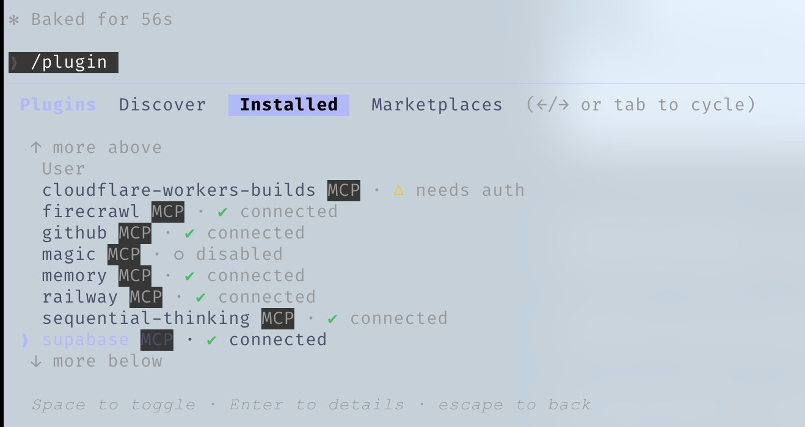
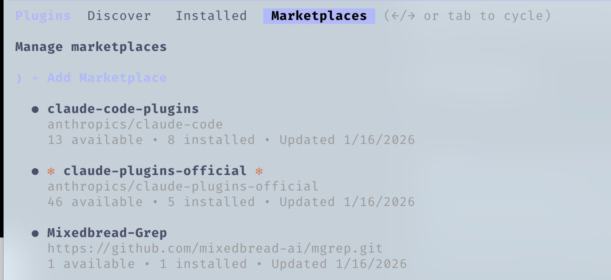

# The FORGE field guide

This guide is for an engineer who has FORGE installed and wants to know what a real working
session looks like: which surface to reach for, what the hooks will stop you doing, how to
delegate without losing the thread, and how to keep the context window from collapsing before
lunch. Read it once end to end; after that it works as a lookup.

Prerequisites:

- FORGE installed via `npx forge-universal setup` or the `forge@forge` plugin. See
  [getting started](./getting-started.md) and [docs/INSTALLATION.md](../docs/INSTALLATION.md).
- A working knowledge of your harness's basics: slash commands, file references, permission
  prompts.
- Git, Node.js 18 or newer, and a terminal you are willing to keep open.

---

## Contents

- [The shape of a session](#the-shape-of-a-session)
- [Skills: the durable unit](#skills-the-durable-unit)
- [Commands: the shim layer](#commands-the-shim-layer)
- [Agents: delegation with a scope](#agents-delegation-with-a-scope)
- [Hooks: the part that says no](#hooks-the-part-that-says-no)
- [Rules and project instructions](#rules-and-project-instructions)
- [MCP servers and the tool budget](#mcp-servers-and-the-tool-budget)
- [Plugins and marketplaces](#plugins-and-marketplaces)
- [Terminal setup](#terminal-setup)
- [Parallel sessions](#parallel-sessions)
- [The status line](#the-status-line)
- [Reviewing agent output](#reviewing-agent-output)
- [Session boundaries: saving and resuming](#session-boundaries-saving-and-resuming)
- [Editors](#editors)
- [A worked session](#a-worked-session)
- [When something goes wrong](#when-something-goes-wrong)
- [Where to go next](#where-to-go-next)

---

## The shape of a session

FORGE does not make the model smarter. It supplies the process the model does not bring on its
own, and it makes that process cheap to invoke:

```text
plan -> test -> implement -> review -> verify -> remember -> improve
```

A session with FORGE installed has a predictable rhythm. The `SessionStart` hook bootstraps
context. You state the goal. Something plans before anything writes. Tests land before the
implementation they describe. A reviewer with a clean context reads the diff. Hooks format and
typecheck on the way past. At the end, the `Stop` and `SessionEnd` hooks record what happened so
the next session does not start from zero.

The parts of that loop live on six surfaces. Knowing which surface owns a behavior is most of
the skill of operating the system:

| Surface | Lives in | Invoked | Owns |
|---|---|---|---|
| Skills | `skills/` | By the model, on relevance | Workflow knowledge and procedure |
| Commands | `commands/` | By you, with `/` | An explicit entry point into a workflow |
| Agents | `agents/` | By the orchestrator | Scoped, disposable delegated work |
| Hooks | `hooks/`, `scripts/hooks/` | By the runtime, on events | Enforcement that does not depend on the model agreeing |
| Rules | `rules/` | Always loaded | Non-negotiable constraints |
| Memory | `~/.claude/session-data/`, instincts | On session boundaries | What survives the context window |

[docs/CONCEPTS.md](../docs/CONCEPTS.md) covers the distinctions in more detail. The rest of this
guide is about using them.

---

## Skills: the durable unit

A skill is a directory with a `SKILL.md` and whatever supporting files the workflow needs. The
frontmatter carries a `name` and a `description`; the description is the only part loaded into
every session, and it is what decides whether the skill gets pulled in at all. The body loads
only when the skill fires.

That progressive load is the whole point. A catalog of hundreds of skills costs a few thousand
tokens of description text. The bodies stay on disk until they are relevant.

List what is actually installed rather than trusting a document:

```bash
ls ~/.claude/skills
ls ~/Desktop/forge/skills
```

A few that carry weight in day-to-day work:

| Skill | Reach for it when |
|---|---|
| `tdd-workflow` | Any new feature or bug fix; enforces test-first with a coverage target |
| `verification-loop` | Before claiming work is complete |
| `security-review` | Auth, user input, secrets, API endpoints, payments |
| `context-budget` | The session feels slow and you want to know what is eating tokens |
| `codebase-onboarding` | First contact with an unfamiliar repository |
| `search-first` | Before writing custom code that a library already provides |
| `git-workflow` | Branching, commit conventions, conflict resolution |
| `continuous-learning-v2` | Turning session discoveries into durable instincts |
| `gateguard` | Forcing investigation before the first edit lands |
| `forge-guide` | Answering "what does FORGE actually have installed here" |

### Writing the description

Most skills that never fire have a bad description. The model matches on it, so it must contain
the words a user would actually type and the situations that should trigger it. Write it as
"use when X", not as a title.

Weak:

```yaml
description: Database helper skill.
```

Usable:

```yaml
description: >-
  Postgres schema design, migrations, index selection, and RLS policies.
  Use when creating or altering tables, writing migrations, debugging slow
  queries, or reviewing row-level security.
```

### When a skill earns its place

Write a skill when a procedure has been repeated three times, has a known failure mode, or
encodes a decision you do not want relitigated. Do not write a skill for a one-off. Do not write
a skill that restates what the model already does well.

`skill-scout` searches local, marketplace, and public sources before you write a new one.
Running it first is usually faster than authoring.

See [docs/SKILL-AUTHORING.md](../docs/SKILL-AUTHORING.md) for the full format.

---

## Commands: the shim layer

A command is a markdown file in `commands/` with a `description:` frontmatter line. It gives a
workflow an explicit `/name` entry point. FORGE ships 94 of them; the complete table is in
[COMMANDS-QUICK-REF.md](../COMMANDS-QUICK-REF.md).

The distinction that matters: the command is the doorway, the skill is the building. Most FORGE
commands are thin wrappers that hand off to a skill or an agent. `/orch-add-feature` is a
wrapper over the `orch-add-feature` skill. `/security-scan` invokes the `security-reviewer`
agent as a subtask. Keep the logic in the skill so it stays reachable when the model picks it up
on its own, and keep the command so you can force it.

The ones worth memorizing:

```text
/plan               Restate requirements, assess risk, produce a step plan. Waits for confirmation.
/plan-prd           Problem-first PRD, then hands off to /plan
/feature-dev        Guided feature work with codebase understanding up front
/code-review        Review local uncommitted changes, or a PR by number or URL
/build-fix          Detect the build system and route to the right build-resolver agent
/test-coverage      Find gaps and generate the missing tests
/quality-gate       Run the formatter quality gate on a file and report remediation
/refactor-clean     Dead code removal with verification after each change
/save-session       Write session state to ~/.claude/session-data/
/resume-session     Load the most recent session file and orient before working
/security-scan      Run Forge Shield over agents, hooks, MCP config, permissions, secrets
/learn              Extract reusable patterns from this session
/model-route        Recommend a model tier for the task at hand
/cost-report        Local cost report from the cost-tracker metrics log
```

Language-specific families follow a consistent naming shape: `/<lang>-test`, `/<lang>-review`,
`/<lang>-build` for Go, Rust, Kotlin, C++, React, Flutter, Python, Vue, FastAPI. If you work in
one stack, three commands cover most of your loop.

Chaining is normal and usually better than one large prompt. `/plan`, then TDD work through
the `tdd-workflow` skill, then `/code-review`, then `/quality-gate` gives each phase a clean
brief and a checkable output.

---

## Agents: delegation with a scope

An agent is a markdown file with YAML frontmatter declaring `name`, `description`, `tools`, and
`model`. It runs as a subprocess with its own context window and returns a summary. FORGE ships
68 of them; see [AGENTS.md](../AGENTS.md).

Two reasons to delegate, and they pull in different directions:

1. **Context preservation.** A search that would dump 40 files into your window instead returns
   a paragraph. The orchestrator stays clean.
2. **Fresh judgment.** A reviewer that never saw the implementation reasoning cannot be talked
   into agreeing with it. This is why `code-reviewer` and `security-reviewer` are separate
   processes rather than a follow-up prompt.

The core set:

| Agent | Use |
|---|---|
| `planner` | Break a feature into ordered, checkable steps |
| `architect` | System design and scalability decisions |
| `code-explorer` | Locate code across an unfamiliar tree without flooding context |
| `tdd-guide` | Write the failing test, then the implementation |
| `code-reviewer` | Quality and maintainability on a finished diff |
| `security-reviewer` | Vulnerability analysis; also backs `/security-scan` |
| `silent-failure-hunter` | Swallowed errors, empty catch blocks, ignored return values |
| `build-error-resolver` | Route build failures to the right language resolver |
| `refactor-cleaner` | Dead code removal |
| `doc-updater` | Keep docs and codemaps in sync with the source |

Language reviewers and build resolvers exist for most stacks the repo supports. `/build-fix`
picks the right one automatically, so you rarely name them yourself.

### Scoping an agent

Restrict `tools` in the frontmatter. An explorer that cannot write cannot accidentally write.
A reviewer that cannot run `Bash` cannot be argued into running a test that "proves" the code is
fine.

```yaml
---
name: code-explorer
description: Locate implementations, call sites, and conventions across a repository.
tools: Read, Grep, Glob
model: haiku
---
```

Model choice per agent is a real lever. Exploration and mechanical edits run fine on the cheap
tier. Architecture, deep review, and security analysis do not. The reasoning behind the routing
table is in [the complete guide](./the-complete-guide.md#model-selection-and-routing).

### The context gap

A subagent knows the literal query it was handed. It does not know why you asked. That gap is
the most common cause of a useless subagent return.

The fix is to pass objective, not just question. Instead of "find the auth middleware", send
"find the auth middleware; we are adding tenant scoping to it, so I need every call site and any
place the tenant id is currently derived". The `iterative-retrieval` skill formalizes this:
evaluate every return, ask follow-ups before accepting, cap the loop at three cycles.

---

## Hooks: the part that says no

Skills and rules are advice. The model can rationalize its way past advice. Hooks are code that
the runtime executes on lifecycle events, and they do not care what the model concluded.

FORGE registers hooks on seven events. Registrations live in
[hooks/hooks.json](../hooks/hooks.json), implementations in `scripts/hooks/`:

| Event | Purpose | Representative hooks |
|---|---|---|
| `SessionStart` | Bootstrap context, load prior state | `session-start-bootstrap.js` |
| `PreToolUse` | Block or gate before the action happens | `pre-bash-dispatcher.js` (tmux reminder, push reminder, dev-server block, commit quality, `--no-verify` block), `gateguard-fact-force.js`, `config-protection.js`, `doc-file-warning.js`, `suggest-compact.js`, `mcp-health-check.js` |
| `PostToolUse` | Format, typecheck, warn on what landed | `post-edit-format.js`, `post-edit-typecheck.js`, `post-edit-console-warn.js`, `post-bash-build-complete.js` |
| `PostToolUseFailure` | Health checks and failure tracking | `mcp-health-check.js`, `skill-run-tracker.js` |
| `PreCompact` | Persist state before the window is rewritten | `pre-compact.js` |
| `Stop` | Verification before the turn ends | `stop-format-typecheck.js`, `check-console-log.js`, `evaluate-session.js`, `cost-tracker.js` |
| `SessionEnd` | Record and close the session | `session-end-marker.js` |


### Two hooks worth understanding

**`config-protection.js`** blocks modification of existing ESLint, Prettier, and equivalent
config files. Agents reliably try to make a check pass by loosening the check. This hook exits
with code 2 on an attempted edit to an existing protected config, which sends the model back to
fixing the code. First-time creation is allowed.

**`gateguard-fact-force.js`** is a three-stage gate on the first `Edit`, `Write`, or `Bash`
attempt: deny, then state exactly which facts must be gathered, then allow the retry once they
are present. It works because asking a model to self-assess produces agreement, while asking it
to list every importer of a module forces actual `Grep` and `Read` calls. The investigation is
what changes the output, not the question.

### Controlling hooks

Three environment variables gate everything:

```bash
export FORGE_HOOKS_ENABLED=false          # off entirely
export FORGE_HOOK_PROFILE=minimal         # minimal | standard | strict (default: standard)
export FORGE_DISABLED_HOOKS=check-console-log,desktop-notify
```

`minimal` keeps session lifecycle and cost tracking. `standard` adds formatting, typechecking,
and the console-log checks. `strict` layers on the stricter gates. Start on `standard`. Drop to
`minimal` when you are debugging the harness itself, not the code.

### Writing your own

Blocking hooks run on the critical path. Keep `PreToolUse` and `Stop` hooks under about 200ms
and never make network calls from them. Always exit 0 on parse errors, log to stderr with a
`[HookName]` prefix, and route through `scripts/hooks/run-with-flags.js` so the profile and
disable variables keep working.

`/hookify` builds hooks conversationally from a description or from analysis of what went wrong
in the session, which is usually faster than hand-writing the matcher JSON. `/hookify-list` and
`/hookify-configure` manage the resulting rules.

See [docs/HOOKS-GUIDE.md](../docs/HOOKS-GUIDE.md) for the full contract.

---

## Rules and project instructions

Rules are always loaded, so they are expensive and should be short. FORGE keeps them in
`rules/`, organized by language plus a `common/` set. The instructions FORGE injects into the
harness live in [CLAUDE.md](../CLAUDE.md); the rule layer is summarized in
[RULES.md](../RULES.md).

Two workable shapes:

1. A single project `CLAUDE.md` holding everything. Fine for a small repo.
2. A `rules/` directory split by concern: security, coding style, testing, git workflow,
   delegation, performance. Better once the file passes a couple of hundred lines, because you
   can load subsets per project.

What belongs in rules is the set of constraints that must hold regardless of task: no secrets in
source, tests before implementation, no console statements in committed code, module size
limits, delegation thresholds. What does not belong is anything procedural — that is a skill.

A rule the model can talk itself out of is not a rule. If a constraint genuinely must hold,
back it with a hook. `rules-distill` and `hookify-rules` help convert prose rules into
enforceable ones.

---

## MCP servers and the tool budget

An MCP server connects the agent to an external system. Every connected server loads its tool
schemas into every session, whether or not you use them. That cost is paid before you type
anything.

This is the single most common self-inflicted context problem. A nominal 200k window can be
under 100k of usable space once a dozen servers are attached, and quality degrades well before
the window is actually full.

FORGE's position is documented in
[docs/MCP-CONNECTOR-POLICY.md](../docs/MCP-CONNECTOR-POLICY.md): exactly one default connector,
`chrome-devtools`, because interactive Chrome DevTools Protocol sessions genuinely need held-open
state that a one-shot CLI cannot provide. Everything else is a skill wrapping a CLI or REST API,
or an opt-in entry in [mcp-configs/mcp-servers.json](../mcp-configs/mcp-servers.json).

A connector earns a slot only if it is universal across harnesses and genuinely beats a CLI
wrapped in a skill — meaning the job needs session state, streaming, an auth handshake, or
structured browsing that a stateless call cannot express. Stateless request/response work fails
that test. `gh` already exists, is already in the model's training data, and costs a few tokens
per invocation instead of thirty tool schemas per session; the `github-ops` skill wraps it. The
same reasoning retired the documentation, search, and memory servers from the defaults.


Keep servers configured and disabled rather than uninstalled. Configuration is cheap; connection
is not.

```bash
/mcp                                       # what is connected right now
export FORGE_DISABLED_MCPS="chrome-devtools"   # filter FORGE-generated configs at install/sync
```



Working rule of thumb: any number of servers in config, under ten connected, and keep an eye on
total active tool count. When a session feels sluggish and forgetful, check the tool inventory
before blaming the model. `context-budget` audits consumption across agents, skills, servers,
and rules and returns a prioritized list of what to cut.

More in [docs/MCP-GUIDE.md](../docs/MCP-GUIDE.md).

---

## Plugins and marketplaces

A plugin bundles skills, commands, hooks, agents, and MCP configuration into one installable
unit. FORGE itself ships as one, under the slug `forge@forge`.

```text
/plugin marketplace add <repository-url>
/plugin install <name>@<marketplace>
```



Language Server Protocol plugins are the highest-value category if you run your agent outside an
editor. They give it real type information, go-to-definition, and diagnostics without an IDE
process attached.

Two cautions. Plugins carry the same context cost as anything else they install; a plugin adding
twelve commands and an MCP server is not free. And a marketplace is a supply chain — skills are
instructions the model follows and hooks are code the runtime executes. Read what you install,
pin what you can, and run `/security-scan` over the result. Reasoning in
[the security guide](./the-security-guide.md#supply-chain-risk-in-skills-plugins-and-marketplaces).

---

## Terminal setup

### tmux for anything long-running

Agents start dev servers, watch processes, and test suites that outlive a single tool call. Run
them inside tmux so the output survives, can be reattached, and can be inspected by both you and
the agent.

```bash
tmux new -s dev
tmux attach -t dev
tmux capture-pane -p -t dev | tail -50
```

FORGE nudges toward this: `pre-bash-tmux-reminder.js` fires on package manager and test commands
when `$TMUX` is unset, and `auto-tmux-dev.js` handles dev-server startup.

[Recording: a tmux session streaming a long-running command](../assets/images/shortform/07-tmux-video.mp4)

### Dev server discipline

`pre-bash-dev-server-block.js` exists because agents start dev servers in the foreground, block
their own tool call, and then time out. Servers belong in tmux or a process manager. `/pm2`
generates process manager commands for the services it detects in the project.

### Keyboard

The interaction primitives that matter on any harness: a prefix for direct shell commands, a
prefix for file references, a prefix for slash commands, multi-line input, and an interrupt that
stops generation without killing the session. Learn the interrupt first. The difference between
a good session and a bad one is often how early you stop a wrong direction.

---

## Parallel sessions

Parallelism is a tool for throughput, not a scoreboard. Every added session costs attention, and
attention is what makes agent output trustworthy. Add a session when a specific piece of work is
genuinely independent, not to hit a number.

### Forking versus worktrees

**Fork** the conversation when the second task does not write files: questions about the
codebase, research on an external API, reading a spec. The fork inherits context and costs
nothing in repository state.

**Git worktrees** when two sessions both write. Each worktree is an independent checkout with
its own branch and its own working directory, so two agents cannot fight over the same files.

```bash
git worktree add ../project-feature-a feature-a
git worktree add ../project-refactor refactor-branch
```

Then run a session in each. Name them so you can tell them apart in a tab strip.

### The default two-terminal layout

One terminal owns code changes. One terminal answers questions and does research. That split
alone removes most of the pain of a single session, because exploration context stops polluting
implementation context.

### Scaling past two

Beyond two, three rules keep it survivable:

1. Every session gets a written scope before it starts. Overlapping scopes produce merge
   conflicts and contradictory refactors.
2. Sweep in a fixed order — oldest to newest, left to right — so nothing sits unreviewed.
3. Cap concurrent active tasks at three or four. Past that, review quality collapses and you are
   just generating diffs you will not read.

`forge sessions` and `/sessions info` give you branch, worktree path, and recency across running
sessions, which is what you need to answer "what is that tab doing" without switching to it.

The `parallel-execution-optimizer` skill helps decompose a task into genuinely independent lanes.
Deeper treatment in [the orchestration guide](./the-orchestration-guide.md).

---

## The status line

The status line is the cheapest observability you will ever install. FORGE ships one at
`scripts/hooks/forge-statusline.js`, registered under `statusLine` in settings rather than in
`hooks.json`, with a config template at [examples/statusline.json](../examples/statusline.json).

It renders model, current task, session cost, tool call count, files modified, elapsed time,
directory, and a context usage bar:

```text
Opus 4.6 | Fixing auth bug | $1.23 47t 5f 15m | myproject ███████░░░ 68%
```

The bar changes color as context fills: green below 50 percent, yellow below 65, orange below
80, and a blinking red past 80. The metrics come from `forge-metrics-bridge.js`, a `PostToolUse`
hook that writes the bridge file the status line reads. Both need to be installed for the full
display.

Why it matters: context exhaustion is the failure that produces the worst output and the least
obvious symptom. The model does not announce degradation; it just starts forgetting decisions it
made an hour ago. A number on screen turns that into something you can act on before compaction
rewrites your session for you.

Cost visibility does the same for spend. `/cost-report` reads the same log that `cost-tracker.js`
writes on every `Stop`.

---

## Reviewing agent output

Everything above is production. This is quality control, and it is the part most setups skip.

### Never review in the context that wrote it

An agent that just spent forty tool calls justifying an approach is the worst possible reviewer
of that approach. Delegate review to a process with a clean window and only the diff:

```text
/code-review          local uncommitted changes, or a PR by number/URL
/review-pr            multi-agent PR review
/security-scan        Forge Shield over config, hooks, MCP, permissions, secrets
/quality-gate         formatter gate on a single file
```

`santa-loop` goes further: two independent reviewers must both approve before code ships, which
catches the case where one reviewer is simply wrong. It costs roughly double a single review.
Use it on anything touching auth, money, or data destruction.

### Read the diff, not the summary

The summary is generated by the same process that wrote the code and inherits its blind spots.
`git diff` is ground truth. Specifically look for:

- Tests that assert nothing, or assert the implementation rather than the behavior.
- Error handling that catches and swallows. `silent-failure-hunter` exists for this.
- Config files that changed when they should not have. `config-protection.js` blocks most of
  these, but check.
- New dependencies. Every one is a supply-chain decision.
- Scope creep — files touched that have nothing to do with the stated task.

### Make verification mechanical

If a claim of completion can be checked by a command, it should be. `verification-loop` and the
`delivery-gate` stop hook exist to make "done" mean something: the gate blocks the turn from
ending while checks are failing, and it specifically watches for rationalization language in the
final message.


The same review agents run in CI. A reviewer that only exists on your laptop reviews only your
commits.

---

## Session boundaries: saving and resuming

Context does not survive. Files do.

```text
/save-session       write state to ~/.claude/session-data/YYYY-MM-DD-<id>-session.tmp
/resume-session     load the most recent file and orient before working
/sessions           list, load, alias, and inspect session history
```

A session file is only useful if it records the three things a fresh context cannot reconstruct:

- What worked, with the evidence that proves it.
- What was tried and failed, and why — this is the part that stops the next session repeating
  the same dead end.
- What has not been attempted and what remains.

Run `/save-session` before you are forced to. Saving at 80 percent context produces a good file;
saving at 98 percent produces a summary written by a model that has already lost the details.

`forge sessions` and `forge session-inspect` read the same state from the CLI, which is what you
want when you are triaging several sessions at once.

The mechanics and the reasoning are in
[the complete guide](./the-complete-guide.md#session-storage-and-resumption).

---

## Editors

Any terminal works. What an editor adds is the ability to see what changed while it is changing.
The properties that matter, in priority order: responsiveness under rapid external file changes,
reliable file watching, autosave (the agent reads from disk, so unsaved buffers are stale
content), a good diff and staging surface, and low resource usage.


Editor-integrated extensions offer a graphical surface over the same session, which some people
prefer for reviewing diffs inline.


Whatever you pick: split the screen, agent on one side, files on the other. Reviewing in the
same pane the agent is writing into does not work.

FORGE supports Claude Code fully and provides capability-limited adapters for other harnesses.
Check [docs/HARNESS-MATRIX.md](../docs/HARNESS-MATRIX.md) before assuming a feature exists on
yours.

---

## A worked session

A medium feature — add tenant scoping to an existing API — start to finish.

```text
/resume-session
/plan add tenant scoping to the orders API, including the middleware and every query path
# tdd-guide writes failing isolation tests, then the implementation
/code-review
/security-scan
/learn
/save-session
```

**Orient.** `/resume-session` loads the last state file. If there is none,
`codebase-onboarding` produces an architecture map, entry points, and conventions without
reading the whole tree.

**Plan before anything writes.** `/plan` restates the requirement, names the risks, and stops
for confirmation. Read the plan. A wrong plan caught here costs one message; caught after
implementation it costs the session.

**Establish the contract in tests.** Failing tests describing tenant isolation land before any
implementation exists. If you cannot state the test, the requirement is not yet clear enough to
implement.

**Implement.** `post-edit-format.js` and `post-edit-typecheck.js` run on each write, so type
errors surface within seconds rather than at the end. `gateguard-fact-force.js` blocks the first
edit until the model has enumerated every call site.

**Review from clean context.** `/code-review` on the diff, and `/security-scan` because this
touches an authorization boundary. Then the full test suite, with the `delivery-gate` stop hook
refusing to end the turn while checks fail.

**Remember.** `/learn` extracts anything non-obvious — a library quirk, a project convention, a
debugging technique — into a candidate instinct or skill. `/save-session` writes the state file.

Seven steps, most of them one command. The value is that the same seven happen every time,
including on the day you are tired and would have skipped review.

---

## When something goes wrong

**Sessions degrade after an hour.** Check the context bar. Check `/mcp` for connected servers you
are not using. Run `context-budget`. Compact at a phase boundary with `strategic-compact` rather
than letting auto-compaction fire mid-task.

**A hook is blocking work that is legitimate.** Identify it from the `[HookName]` stderr prefix,
then disable that one hook rather than the profile:

```bash
export FORGE_DISABLED_HOOKS=<hook-id>
```

If it blocks legitimate work repeatedly, the matcher is wrong. Fix the matcher.

**Commands or skills are missing.** Something drifted:

```bash
forge doctor            # diagnose missing or drifted managed files
forge repair            # restore them
forge list-installed    # what install-state actually records
```

**The agent keeps making the same mistake.** That is a missing instinct, not a prompting problem.
Run `/learn` or `/hookify` on the failure. Advice goes in a skill; a hard constraint goes in a
hook.

**Costs are higher than expected.** `/cost-report`, then `/model-route` on the task types that
dominate. Exploration and mechanical edits on the top tier is the usual cause.

**Something happened that should not have been possible.** Stop, do not clear the session, and go
to [the security guide](./the-security-guide.md#incident-response).

[TROUBLESHOOTING.md](../TROUBLESHOOTING.md) covers installation and harness-specific failures.

---

## Where to go next

- [The complete guide to FORGE](./the-complete-guide.md) — context economics, model routing,
  memory, evals, and the reasoning behind the defaults above.
- [The FORGE security guide](./the-security-guide.md) — prompt injection, permissions,
  sandboxing, supply chain, incident response.
- [The orchestration guide](./the-orchestration-guide.md) — multi-agent waves and handoffs.
- [The context guide](./the-context-guide.md) — compaction and memory in depth.
- [The evaluation guide](./the-evaluation-guide.md) — proving a change to the system helped.
- [docs/CONCEPTS.md](../docs/CONCEPTS.md) — skills, agents, commands, hooks, rules, memory.
- [docs/RECIPES.md](../docs/RECIPES.md) — task-shaped cookbook.
- [docs/ANTI-PATTERNS.md](../docs/ANTI-PATTERNS.md) — configurations that make things worse.

Five things carry most of the value, if you keep nothing else:

1. Context is the scarce resource. Spend it on the task, not on tool schemas.
2. Put durable logic in skills. Commands are doorways.
3. Enforce with hooks what you cannot afford the model to reason around.
4. Review from a context that did not write the code.
5. Write down what worked, so the next session starts where this one ended.
